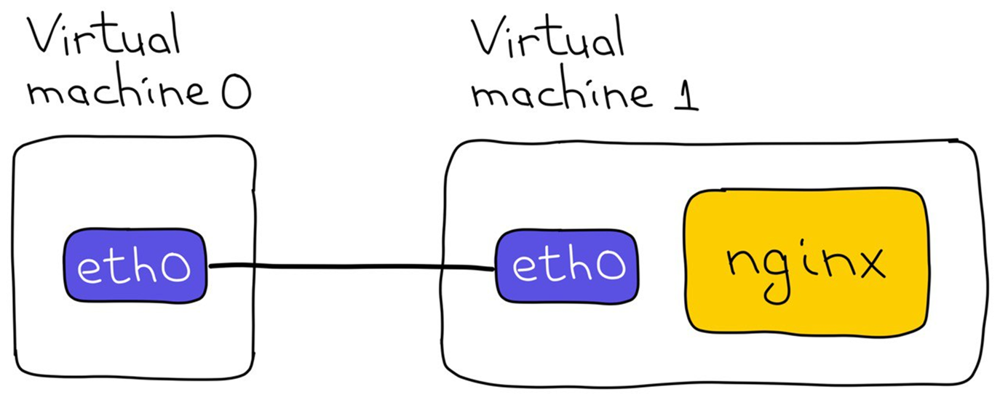

# Домашнее задание по материалам Лекции 4: Сети Часть 1. Коты и коробки
> [!NOTE]
> Необходимо запустить две виртуальные машины с GNU/Linux и обеспечить сетевую связность между ними. Можно использовать публичные облака, системы виртуализации на локальной машине (например, Virtualbox) или даже два физических компьютера, соединённых кабелем.

 
    

 

1.	Проверьте, что с одной машины вы можете пропинговать другую. Запустите на второй машине tcpdump и убедитесь, что вы видите бегающие пинги. Будьте аккуратны с ним, если подключены по SSH. (при необходимости настройте IP-адресацию вручную)
2.	Заблокировать на второй виртуалке входящие ICMP echo запросы при помощи iptables (nftables). Проверить - с первой виртуалки вторая теперь пинговаться не должна, а в tcpdump должны быть видны только ICMP echo request’ы.  Конфигурация фаервола должна восстанавливаться после перезагрузки машины.
3.	Перезагрузите вторую виртуалку, убедитесь, что пинга нет.
4.	Найдите аргумент ping, который позволит явно отобразить потерянные пакеты в консоли вместо тишины.
5.	Запустите на второй виртуалке nginx со статической Hello, World страницей. Запросите эту страницу с другой виртуалки (curl, wget, lynx в помощь, если виртуалка без графического интерфейса).
6.	Заблокируйте на второй виртуалке запросы к nginx при помощи iptables (nftables). Убедитесь, что страница перестала открываться с первой виртуалки.
7.	Сохраните правила iptables и, перезагрузив вторую виртуалку, убедитесь в том, что конфигурация фаервола применилась - вторая виртуалка не должна отвечать ни на пинги, ни на запросы веб-страницы.
